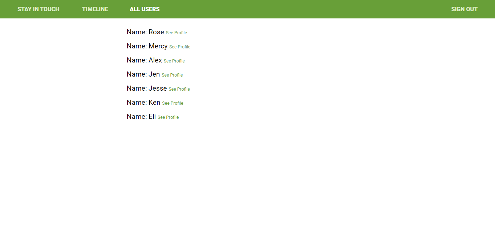
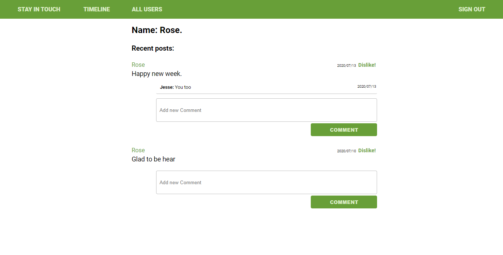
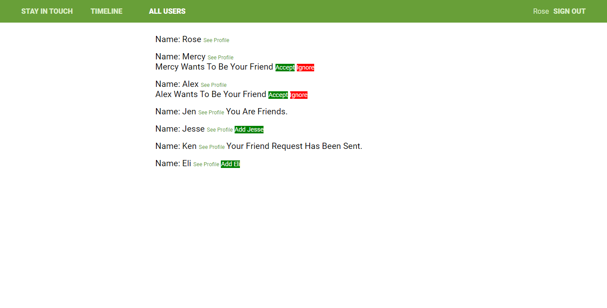
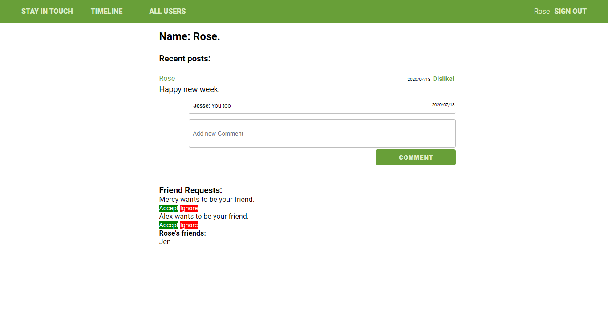

[](mailto:rosewanjohi24@gmail.com)
[](https://twitter.com/blackpintz)

## Stay In Touch App

This project was improving and adding a few functionalities to the already exisiting Stay In Touch social media app. 
You can find the original project repo [here](https://github.com/microverseinc/ror-social-scaffold) 

## Original look of the users' list page



## Original look of a user's show page



## Functionalities add/improved:

- The user is able to send a friendship invitation.
- The user is able to accept or reject a friendship request.
- The user is able to see posts created only by them and their friends.

## Final look of the users's list page



## Final look of a user's show page



[Live demo link](https://limitless-reaches-23856.herokuapp.com/users/sign_in)

## Built With

- Ruby
- Ruby on Rails,
- RSpec and capybara
- Postgresql


## Getting Started


To get a local copy up and running follow these simple example steps.

### Prerequisites

- The project is built using Rails 5 and Ruby-2.7.0
- Install Ruby and Git on local machine


### Setup

- Clone the project into your local machine.
- cd in ror-social-scaffold.
- run ```bundle install```.
- Run ```rails db:migrate```.
- Run ```rails c``` to interact with the database.
- Run ```rails s``` to open the project on the browser.

### Install
- Run ```npm install``` to download all the packages listed in the package.json file.


### Run tests
- For model tests: ```bundle exec rspec spec/models/<insert-name-of-file-from-specs/models-folder>```
- For view tests: ```bundle exec rspec spec/features/<insert-name-of-file-from-specs/features-folder>```
- For controller tests: ```bundle exec rspec spec/controllers/<insert-name-of-file-from-specs/controllers-folder>```
- For helper tests: ```bundle exec rspec spec/helpers/application_helper_spec.rb```


## Authors

- Github: [@blackpintz](https://github.com/blackpintz)
- Twitter: [@blackpintz](https://twitter.com/blackpintz)


## 🤝 Contributing

Contributions, issues and feature requests are welcome!

Feel free to check the [issues page](https://github.com/blackpintz/ror-social-scaffold/pulls).

## Show your support

Give a ⭐️ if you like this project!

## Acknowledgments

- The Odin Project 
- [Stay In Touch Github repo](https://github.com/blackpintz/ror-social-scaffold/pulls)


## 📝 License

This project is [MIT](lic.url) licensed.
